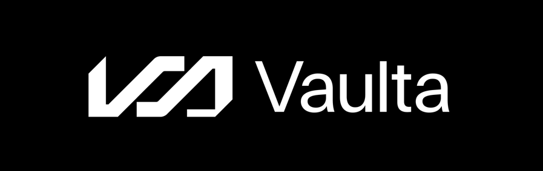

<a href="https://vaulta.com"></img></a>

**Vaulta** - Secure your future.

Vaulta is a Web3 banking network empowering the next frontier of finance. With vault-like security, instant transactions, and real- world integration, Vaulta is a turning point for digital banking. Whether you’re moving assets globally, earning rewards on them, or building cutting-edge financial solutions, Vaulta provides the tools for a secure, fast, and accessible financial ecosystem.

---

 

